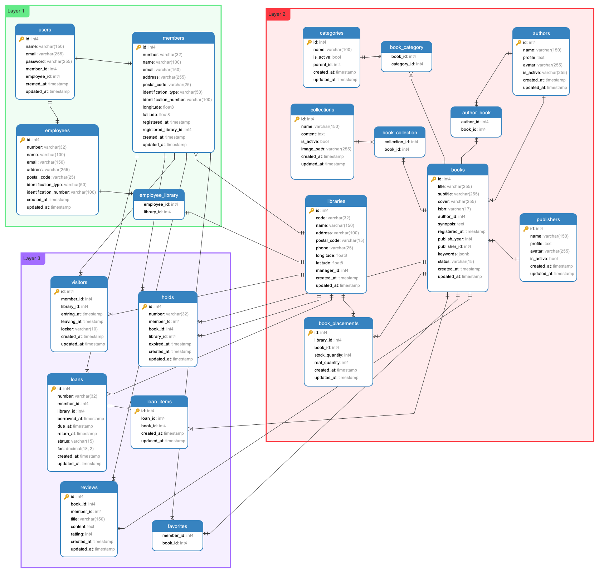

# Pacperpus

Pacperpus is a simple library application that allows you to manage books, visitors, and loans.
It is a simple project that I created to fulfill Pacmann's assignment on
**SQL and Relational Database** in **Data Engineering** class.

## Features

* Manage multiple library branches or offices
* Manage book collection information, title, author, publisher, ISBN and others
* Manage book categories information, category name, and others
* Manage visitor information, name, address, phone number, and others
* Manage loan information, loan date, return date, and others
* Manage hold information, book, hold date, and others
* Visitor registration and login system
* Visitor book favorites system
* Review and rating system for books
* Simple helpdesk system for visitors

## Business Rules

* Before a visitor can borrow a book, the visitor must be registered as a member.
* A visitor can borrow a maximum of 2 books at a time.
* Only books that are in stock can be borrowed.
* Member can hold books that are not in stock and if stock book available member can loans book in FIFO.

## Database Schema

### Tables

This is a list of tables (not all table) in the database schema.

| Table           | Description                                                                                                  |
|-----------------|--------------------------------------------------------------------------------------------------------------|
| books           | Stores information about books, including title, author, publisher, ISBN and status                          |
| authors         | Stores information about author, including name, profile and avatar                                          |
| categories      | Stores information about book categories                                                                     |
| collections     | Stores information about book collections for storing collection of book, example book series                |
| publishers      | Stores information about book publishers                                                                     |
| libraries       | Stores information about library branches or offices                                                         |
| book_placements | Stores information about book placements in the library branches or offices, including stock book            |
| employees       | Stores information about library employees, including name, address, phone number and libraries              |
| members         | Stores information about library members, including name, email, address, phone number, longitude, latitude  |
| users           | Stores information about system users, including name, email, and password                                   |
| visitors        | Stores information about visitors, including member data, entering datetime, leaving datetime, locker number |
| loans           | Stores information about book loans, including member data, loan date, return date, status, due date and fee |
| loan_items      | Stores information about book loan items, including book and loan                                            |
| holds           | Stores information about book holds, including book, library and hold date                                   |
| favorites       | Stores information about visitor book favorites                                                              |
| reviews         | Stores information about book reviews and ratings                                                            |

### Entity Relationship Diagram (ERD)

This is an ERD diagram of the database schema.

## Dummy Data

The dataset is taken mainly from kaggle, namely [elvinrustam/books-dataset](https://www.kaggle.com/datasets/elvinrustam/books-dataset) 
combined with generator. For transaction dataset (borrowing, hold, review, visitors, etc.) using [Faker](https://faker.readthedocs.io/en/master/).

| Dataset     | Status |
|-------------|--------|
| books       | ✅     |
| authors     | ✅     |
| categories  | ✅     |
| publishers  | ✅     |
| collections | 🔄     |
| libraries   | 🔄     |
| employees   | 🔄     |
| members     | 🔄     |
| users       | 🔄     |
| visitors    | 🔄     |
| loans       | 🔄     |
| loan_items  | 🔄     |
| holds       | 🔄     |
| favorites   | 🔄     |
| reviews     | 🔄     |
